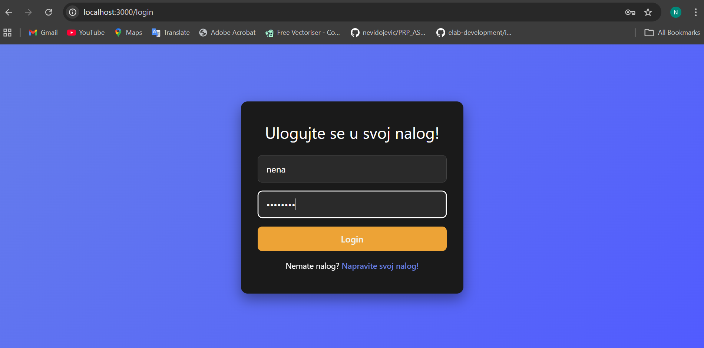
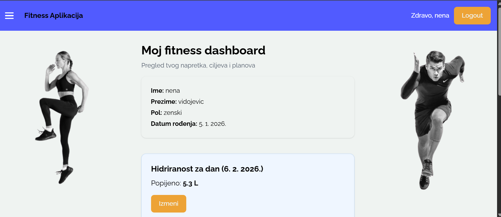
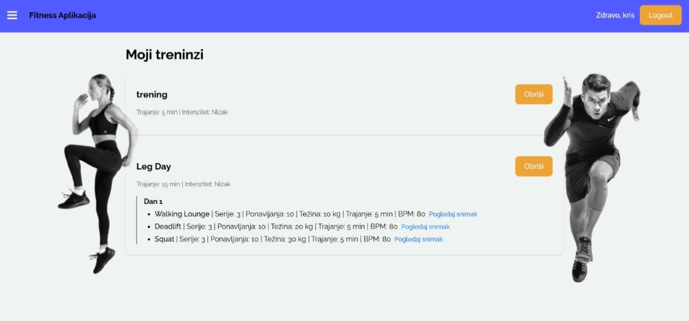
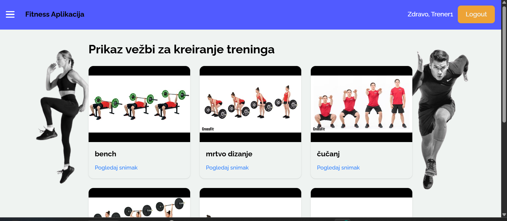

<p align="center"><a href="https://laravel.com" target="_blank"></a></p>

# Personalizovani Fitness Planner

## Informacije o projektu

Univerzitet u Beogradu
Fakultet organizacionih nauka
Katedra za elektronsko poslovanje

Predmet: **Internet tehnologije**

Mentor: **Petar Lukovac**

GitHub repozitorijum:
https://github.com/elab-development/internet-tehnologije-2025-fitnesplanerapk

---

# Autori
- Nevena Vidojević (2022/0081)  
- Hristina Vidaković (2022/0076)  
- Kristina Atanasković (2022/0092)  

---

# Opis aplikacije

**Personalizovani Fitness Planner** je web aplikacija namenjena korisnicima koji žele da planiraju i prate svoje fitness aktivnosti.
Aplikacija omogućava korisnicima da planiraju, prave i beleže svoje planove treninga koristeći vežbe iz baze aplikacije, prate svoju ishranu zapisujući svoje obroke, unos tečnosti tokom dana, kao i beleže svoje parametre i ciljeve i kako se oni menjaju tokom vremena. Ukoliko korisnik to želi, može da ili postavi svog trenera, ili koristi već gotove treninge koje su treneri objavili tako da budu vidljivi za celu publiku. Aplikacija je poptuno zaštićena i omogućava da svako ima pristup svojim funkcionalnostima, bilo da ima ulogu korisnika, trenera ili admina. Iskustvo u samoj aplikaciji je poboljšano korišćenjem eksternih API-ja za pretragu namirnica i njihovih kalorijskih vrednosti, kao i za predloge recepata koji mogu poslužiti kao inspiracija za obroke. Takodje su sve bitne statistike koje korisnicima mogu značiti za praćenje napretka, grafički prikazane na stranicama.

Cilj aplikacije je da korisnicima omogući bolju organizaciju treninga i ishrane, kao i praćenje napretka kroz vreme.

---

# Tehnologije

U projektu su korišćene sledeće tehnologije:

### Frontend

* React
* Vite
* Axios
* Tailwind CSS

### Backend

* Laravel (PHP framework)

### Baza podataka

* MySQL

### Komunikacija

* REST API
* JSON

---


# DevOps i infrastruktura

U projektu se koriste sledeće DevOps tehnologije:

- Docker za pokretanje aplikacije u kontejnerima
- docker-compose za orkestraciju servisa
- GitHub za verzionisanje koda
- GitHub Actions za CI/CD pipeline
- Cloud deployment 
---

# Eksterni API servisi

Aplikacija koristi nekoliko eksternih API servisa.

## USDA FoodData Central API

Koristi se za pretragu nutritivnih vrednosti namirnica.

---

## ZenQuotes API

Koristi se za prikaz motivacionih citata na dashboard-u.

Endpoint:

https://zenquotes.io/api/random

# Glavne funkcionalnosti

Aplikacija omogućava:

## Upravljanje korisnicima
- registraciju i prijavu korisnika
- autentifikaciju pomoću tokena
- upravljanje ulogama korisnika

## Upravljanje treninzima
- kreiranje personalizovanih trening programa
- izbor vežbi iz baze
- podešavanje parametara vežbi (serije, ponavljanja, trajanje, težina, BPM)
- pregled trening programa
- brisanje i izmena programa
- biranje programa trenera

## Upravljanje ishranom
- unos obroka po danima
- unos namirnica 
- automatski obračun kalorija
- pregled dnevnog kalorijskog unosa

## Praćenje hidriranosti
- unos količine popijene vode
- pregled dnevne hidriranosti
- praćenje napretka u odnosu na cilj

## Praćenje napretka
- grafički prikaz promene telesnih parametara
- istorija ciljeva
- statistika hidriranosti

---

# Uloge u sistemu

## Korisnik
Korisnik ima mogućnost da:
- registruje i prijavi nalog
- unese svoje fizičke parametre
- postavi ciljeve
- kreira trening programe
- upravlja planom ishrane
- prati hidriranost
- pregleda statistiku napretka

Korisnik nema pristup podacima drugih korisnika.

---

## Admin
Administrator ima mogućnost da:
- se prijavi na sistem
- vidi listu korisnika
- dodaje vežbe u bazu
- briše vežbe
- upravlja bazom vežbi

---

## Trener
Trener ima mogućnost da:
- pregleda bazu vežbi
- kreira trening programe vežbačima
- omogući korisnicima da koriste pripremljene treninge

---

# Pokretanje aplikacije bez Docker-a

## Kloniranje projekta

```bash
git clone https://github.com/elab-development/internet-tehnologije-2025-fitnesplanerapk.git
cd internet-tehnologije-2025-fitnesplanerapk
```

---

# Backend (Laravel)

Instalacija zavisnosti:

```bash
composer install
```

Kreiranje `.env` fajla:

```bash
cp .env.example .env
```

Generisanje ključa:

```bash
php artisan key:generate
```

Migracija baze:

```bash
php artisan migrate
```

Pokretanje servera:

```bash
php artisan serve
```

Backend će biti dostupan na:

```
http://127.0.0.1:8000
```

---

# Frontend (React)

Prelazak u React folder:

```bash
cd react
```

Instalacija zavisnosti:

```bash
npm install
```

Pokretanje aplikacije:

```bash
npm run dev
```

Frontend će biti dostupan na:

```
http://127.0.0.1:3000
```

---

# Pokretanje pomoću Docker-a

```
docker-compose up --build
```

# Komanda za pokretanje kontejnera u pozadini
```
docker-compose up -d  
```
# Komanda za gašenje okruženja
```
docker-compose down
```
---


# Vizualizacija podataka

Za prikaz statistike koristi se biblioteka:

**react-google-charts**

Prikazani grafici:

- Donut grafikon dnevne hidriranosti
- Linijski grafikon promene težine i BMI
- Grafikon istorije ciljeva

---


# Screenshotovi aplikacije

## Login stranica



## Dashboard



## Trening program



## Pregled vežbi




# Licenca

Ovaj projekat je razvijen u edukativne svrhe u okviru kursa **Internet tehnologije** na Fakultetu organizacionih nauka.
